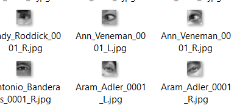

# Drawsiness-Detection-with-CNN-and-TransferLearning

## DataSet
used CEW dataset this is the link http://parnec.nuaa.edu.cn/_upload/tpl/02/db/731/template731/pages/xtan/ClosedEyeDatabases.html

There are 4 different files in the dataset closedLeft - closedRight, openedLeft-OpenedRight
However I did not distinguish eyes as left or right. I copied from all labeled open images to train file
and all labeled closed images to valid file.

## CNN from Scratch

I built a CNN model has 4 convolution layers and applied BahtchNormalization on each layers. 
Before output layer applied DropOut to prevent overfitting.

### Transfer Learning with VGG16

Pretrained models like VGG16 are commonly used for computer vision tasks.
I chose VGG16 and froze the pretrained layers. Then I add softmax layer 
end of model layers.

 In this task both models have high accuracy.
